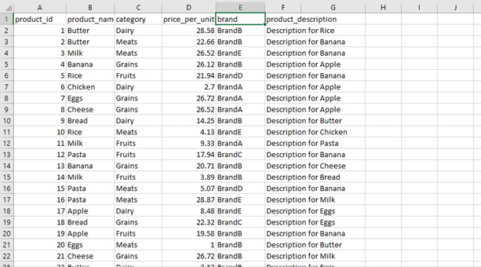

# Building an End-to-End Business Intelligence Solution for Market and Sales Insights  
**From ETL to Predictive Analytics** 

---
In today’s data-driven economy, information is power.  
Organizations that know how to collect, process, and analyze their data are better equipped to make timely and strategic decisions.

This project aimed to design and implement a complete Business Intelligence (BI) solution exploring opportunities for market positioning in the sales of products and related services.

By integrating SQL Server, SSIS, SSAS, Power BI, and Python, we developed a system that transforms raw datasets into actionable insights, combining data warehousing, analytics, and visualization into one cohesive ecosystem.

---

## Project Objectives
The main goal was to create a BI platform that supports data-driven decision-making.

**Specific objectives:**
- Segment customers based on demographics and purchasing behavior  
- Identify high-performing and underperforming products  
- Explore sales trends and seasonality  
- Forecast future sales using predictive models  
- Recommend products tailored to customer preferences  

---

## Data Overview
We used three datasets from the [Sales Product and Customer Insight Repository by SvbStan on Kaggle](https://www.kaggle.com/datasets/svbstan/sales-product-and-customer-insight-repository).  
These datasets served as the foundation for building our BI model and analytical environment.

### Customer Dataset
Contains demographic information such as gender, age, and location.

**Attributes:**
customer_ID, first_name, last_name, gender, date_of_birth, email, phone_number, signup_date, address, city, state, zip_code

**Sample:**

<em>Figure 1: Sample from Customer Dataset</em>

---

### Product Dataset
Includes product details such as brand, category, price, and stock availability.

**Attributes:**
product_id, product_name, category, price_per_unit, brand, product_description

**Sample:**

<em>Figure 2: Sample from Product Dataset</em>

---

### Transaction Dataset
Links customers and products through purchases, providing transaction-level details.

**Attributes:**
purchase_id, customer_id, product_id, purchase_date, quantity, total_amount

**Sample:**

<em>Figure 3: Sample from Transaction Dataset</em>

---

## System Architecture

Data flows through a series of specialized layers, each designed to perform a specific role in the transformation from unprocessed data to practical insights.

<em>Figure 4: Global Architecture of the BI Solution</em>

---

## ETL Process (Extract, Transform, Load)

### Extraction

The extraction phase centralizes raw data from multiple CSVs into SQL Server staging tables. Using an SSIS project, data is loaded via Flat File Sources, validated for type and integrity, and prepared for transformation, ensuring consistent, high-quality input.

<em>Figure 5: ETL Extraction Workflow</em>

---

### Transformation

Following validation, the transformation phase cleansed, enriched, and standardized the data. This involved implementing a star schema (including dimension and fact tables), pre-calculating KPIs like profit, and using SSIS components to automate the process, resulting in analysis-ready data.

---

### Loading

The final load phase populated the Data Warehouse using the optimized star schema. The fact_sales table, linked to dimCustomer, dimProduct, and dimDate, now contains pre-calculated KPIs, enabling fast analytics and Power BI reporting.

<em>Figure 7: Star Schema of the Data Warehouse</em>

---

## Analytical Modeling (SSAS)

The BI system's analytical capabilities were implemented by creating an OLAP cube in SSAS. This cube structures the data warehouse information, incorporating key hierarchies within the Customer, Product, and Date dimensions to facilitate intuitive multidimensional exploration and aggregated analysis for end-users.

---

## Machine Learning Integration

### Customer Segmentation (K-Means)

K-Means clustering segmented customers by purchase frequency and total spend, identifying two core groups: low-spending occasional buyers and high-value loyal customers.

<em>Figure 9: Customer Segmentation Visualization</em>

### Predictive Sales Forecasting (SARIMA)

To anticipate future demand, we built a sales forecast using a SARIMA model, which accounts for both seasonal patterns and underlying trends in the historical data.

<em>Figure 10: Sales Forecast Using SARIMA</em>

### Product Recommendation (SVD)

To personalize product suggestions, we developed a recommender model using Singular Value Decomposition (SVD) that leverages individual purchase history and collective customer patterns.

---

## Data Visualization (Power BI)

### Customer Insights Dashboard

The dashboard provides a segmented view of customer behavior, highlighting key performance indicators such as total customer count, regional expenditure, and customer loyalty metrics.

<em>Figure 12: Customer Insights Dashboard</em>

### Product and Sales Performance Dashboard

The product and sales dashboard provides visibility into key financial metrics, visualizing revenue, profit, and growth trends. It identifies leading categories and regions to help managers track performance against objectives.

<em>Figure 13: Product and Sales Performance Dashboard</em>

## Conclusion
This project demonstrates how Business Intelligence transforms raw data into strategic value.  
By combining ETL pipelines, OLAP modeling, dashboards, and machine learning, we built a scalable and complete decision-support system.

> "Data becomes powerful only when it leads to action."

---

## Read More & Feedback
For a more detailed explanation of this project, including insights, methodology, and additional visuals, you can read the full article on Medium:

[Building an End-to-End Business Intelligence Solution for Market and Sales Insights](https://medium.com/@bnyiche.mouna/building-an-end-to-end-business-intelligence-solution-for-market-and-sales-insights-from-etl-to-67070d495b45)

We welcome your comments, questions, and feedback. Your insights and suggestions are highly appreciated!

